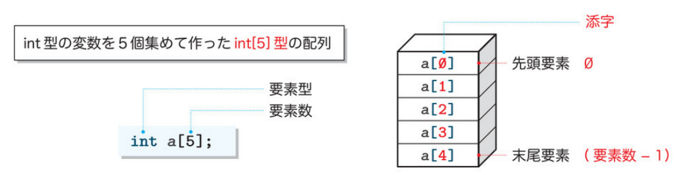
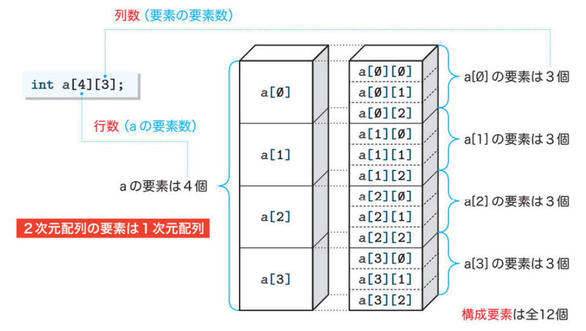
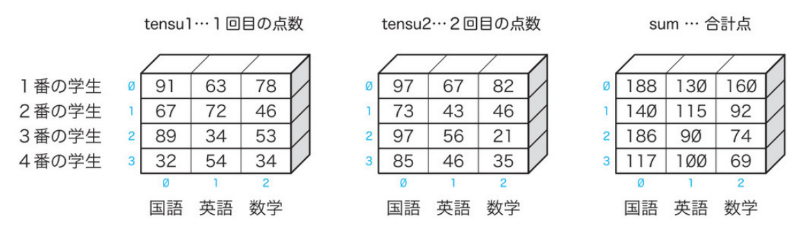
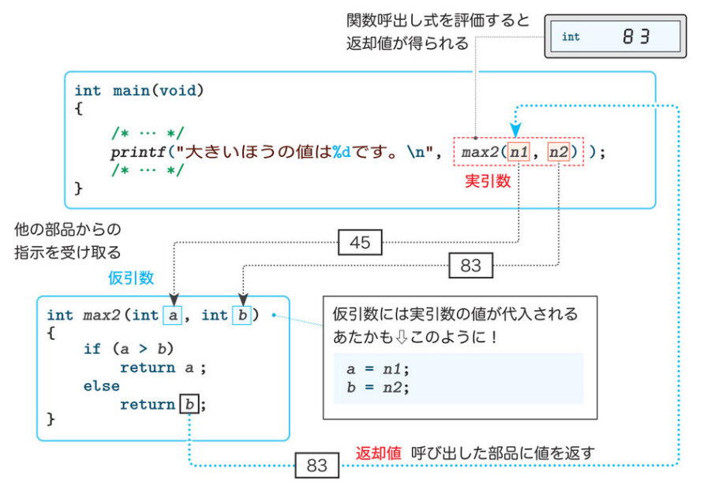
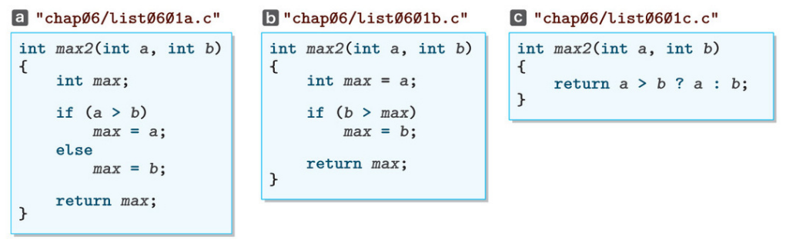
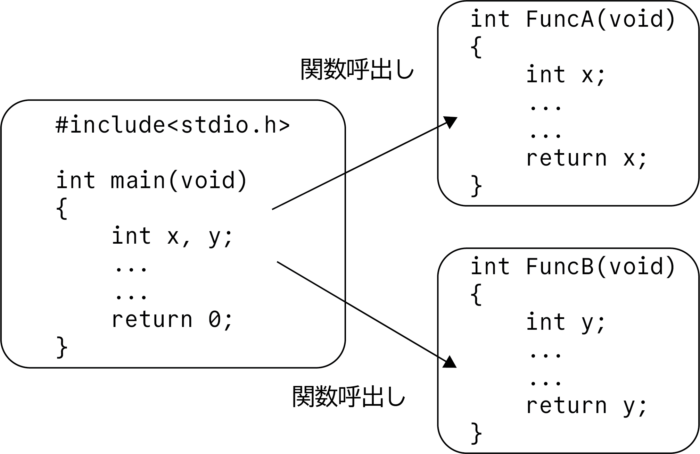
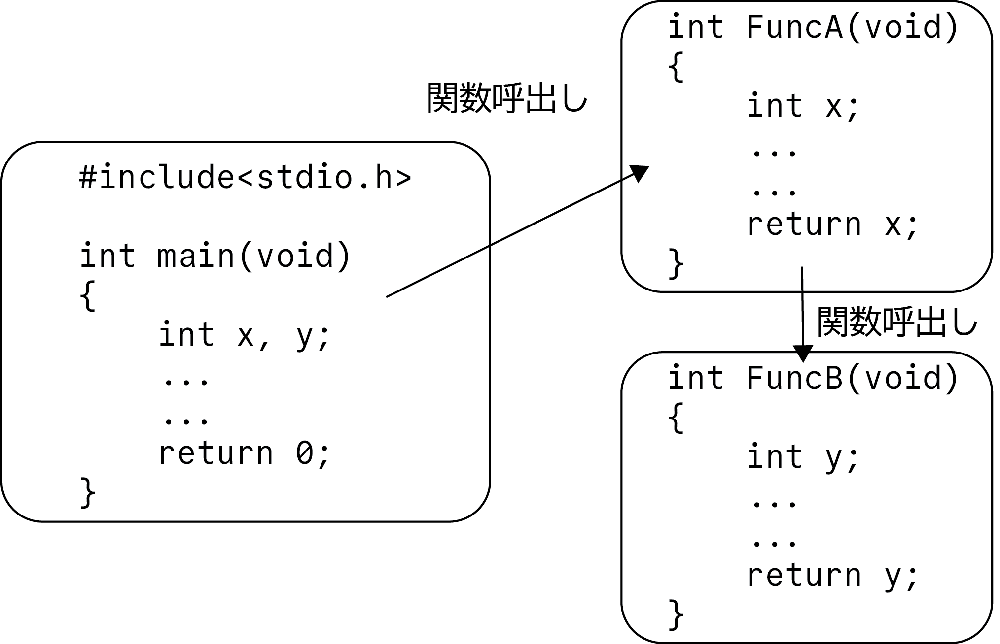
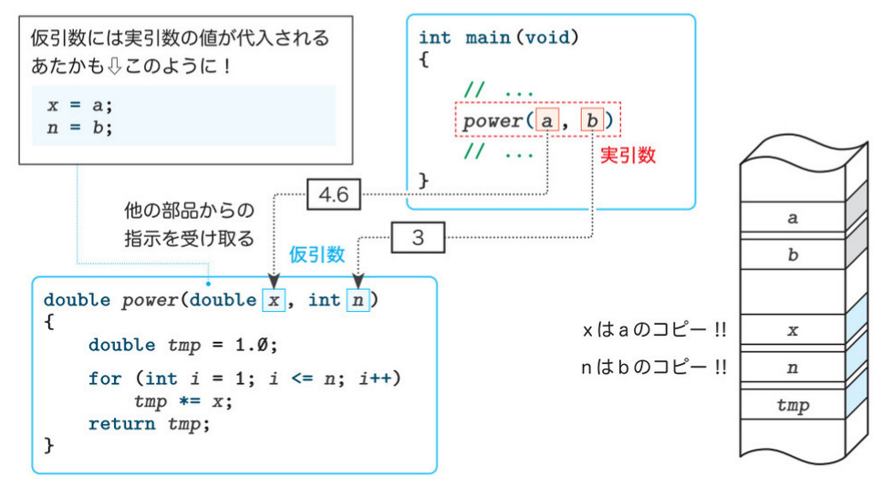
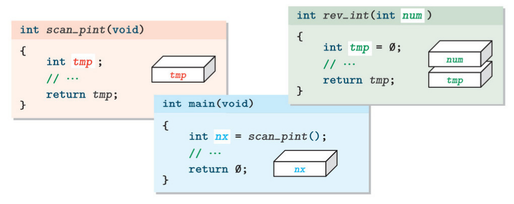
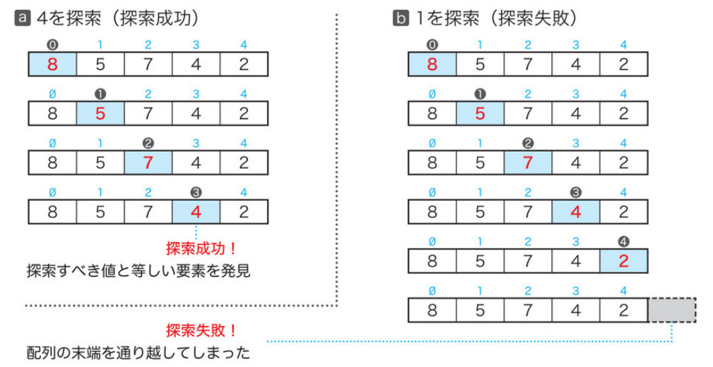

# プログラミング実習
# 第3回授業資料
**配列と関数**

講義担当：清水 哲也(shimizu@info.shonan-it.ac.jp)

---

# 今回の授業内容

- 前回の授業課題と宿題の解答例
- 配列
- 関数
  - 関数とは
  - 関数の設計
  - 有効範囲と記憶域期間
- 宿題

---

<div Align=center>

# 前回の授業課題と宿題の解答例

</div>

---

# 前回の授業課題と宿題の解答例

ざっくりと説明します

---

<div Align=center>

# 配列

</div>

---

# 配列

同じ型の変数を一つの集めたものが配列です．

## 例1
5人の学生の点数を読み込んで，その合計点と平均点を求めて表示するプログラムを作りましょう

---

# 配列：例1（配列を使わないプログラム）

```C
// 5人の学生の点数を読み込んで合計点と平均点を表示
#include <stdio.h>

int main(void)
{
    int point1;  // 1番の点数
    int point2;  // 2番の点数
    int point3;  // 3番の点数
    int point4;  // 4番の点数
    int point5;  // 5番の点数
    int sum = 0; // 合計点

    printf("5人の点数を入力せよ．\n");
    printf("1番："); scanf("%d", &point1); sum += point1;
    printf("2番："); scanf("%d", &point2); sum += point2;
    printf("3番："); scanf("%d", &point3); sum += point3;
    printf("4番："); scanf("%d", &point4); sum += point4;
    printf("5番："); scanf("%d", &point5); sum += point5;

    printf("合計点：%5d\n", sum);
    printf("平均点：%5.1f\n", (double)sum / 5);

    return 0;
}
```

---

# 配列：例1の補足
前のページのプログラムで補足です．

```C
    printf("1番："); scanf("%d", &point1); sum += point1;
```

この部分は，普通は以下のように書きます．

```C
    printf("1番：");
    scanf("%d", &point1);
    sum += point1;
```

スペース的な問題や慣れてくると上のような書き方をしてもいいと思います．

---

# 配列の宣言（配列を使うための準備）

例1のプログラムでは，5人のデータなので書いてもそこまで苦労はしないです．
これがこのクラス全員となる約70人分になるので変数を70個用意する必要ことになります．
ここで**配列**を用います．
配列は，**要素型**，**配列名**，**要素数**で宣言します．
```C
要素型 配列名[要素数];
```

<div Align=center>



</div>

---

# 要素と添字

配列の要素にアクセスするために使うのが**添字演算子**です．

添字演算子：`a[b]`　配列`a`の先頭から`b`個後ろの要素をアクセスする．

要素数と添字の関係は`要素数-1=添字の最大`となります．

例：`int a[5]`と配列を宣言した場合

先頭から順に`a[0], a[1], a[2], a[3], a[4]`となります．なので，`a[5]`は存在しません．

---

# 配列の走査(1)

**走査**：配列の要素を一つずつ順番になぞっていくこと

```C
// 配列の各要素に先頭から順に１〜５を代入して表示
#include <stdio.h>
int main(void)
{
    int a[5]; // int[5]型の配列
    a[0] = 1;
    a[1] = 2;
    a[2] = 3;
    a[3] = 4;
    a[4] = 5;

    printf("a[0] = %d\n", a[0]);
    printf("a[1] = %d\n", a[1]);
    printf("a[2] = %d\n", a[2]);
    printf("a[3] = %d\n", a[3]);
    printf("a[4] = %d\n", a[4]);
    return 0;
}
```

---

# 配列の走査(2)

前のページのプログラムでもいいのですが，これは非効率的です．繰り返しの部分を`for`文を使って書き換えます．

```C
// 配列の各要素に先頭から順に１〜５を代入して表示(for文を使う)
#include <stdio.h>

int main(void)
{
    int a[5]; // int[5]型の配列

    for (int i = 0; i < 5; i++) // 要素に値を代入
        a[i] = i + 1;

    for (int i = 0; i < 5; i++) // 要素の値を表示
        printf("a[%d] = %d\n", i, a[i]);

    return 0;
}
```
---

# 配列の初期化

配列の各要素へ値を代入するのではなく，**初期化**で設定する方法があります．

```
要素型 配列名[要素数] = {値1, 値2, ...};
```
このように配列の宣言と同時に各要素に値を入れることができます．

`要素数`を省略することもでできます．
```C
int a[] = {1, 2, 3};
```
この場合は，各要素の値の数が自動的に配列の要素数となります．

各に要素にすべて同じ値を入れることもできます．
```C
int b[5] = {0};
```
この場合は，`要素数`を指定必要があります．

---

# 配列の要素に値を読み込む

配列の要素の値を，キーボードから読み込むようにします．

```C
// 配列の要素に値を読み込んで表示
#include <stdio.h>

int main(void)
{
    int x[5];

    for (int i = 0; i < 5; i++) // 要素に値を読み込む
    {
        printf("x[%d] : ", i);
        scanf("%d", &x[i]);
    }

    for (int i = 0; i < 5; i++) // 要素の値を表示
        printf("x[%d] = %d\n", i, x[i]);

    return 0;
}
```

---

# 配列：例1（配列を使うプログラム）

```C
// 配列を用いて例1をプログラムする
#include <stdio.h>
#define NUM 5

int main(void)
{
    int point[NUM]; // int[5]型の配列を用意
    int sum = 0;    // 合計点

    printf("%d人の点数を入力せよ．\n", NUM);

    for (int i = 0; i < NUM; i++)
    {
        printf("%d番：", i + 1);
        scanf("%d", &point[i]);
        sum += point[i];
    }

    printf("合計点：%5d\n", sum);
    printf("平均点：%5.1f\n", (double)sum / NUM);

    return 0;
}
```

---

# 多次元配列

配列の要素自体が**配列**であるものを**多次元配列**と呼びます．

配列の要素が配列のものを**2次元配列**とよび，更にその2次元配列を要素とする配列は**3次元配列**と呼びます．
ここで言う**次元**は立体などの次元ではないですが，3次元配列までのイメージとしてはそれでいいです．
例えば，2次元配列の宣言は以下のようになります．

```C
要素型 配列名[要素数][要素数];
```

---

# 多次元配列

```C
int a[4][3];
```

<div Align=center>



</div>

---

# 多次元配列

## 注意
`int a[4][3]`と`int a[3][4]`は全要素数は変わらないですが構造が違うの注意が必要です．

## 重要
多次元配列の構成要素は，末尾側の添字が優先的に増えていく順に並ぶ．
`a[0][0] a[0][1] a[0][2]` `a[1][0] a[1][1] a[1][2]` $\cdots$ `a[3][0] a[3][1] a[3][2]`

---

# 多次元配列

2次元配列のプログラム例です．
- テストの点数の合計を求めるプログラムです
- 学生は4人です
- 教科は3教科です
- テストの回数は2回です
- 科目別の合計を求めて表示します

<div Align=center>



</dvi>

---

<div Align=center>

# 関数

</dvi>

---

<div Align=center>

# 関数とは

</dvi>

---

# main関数とライブラリ関数

## main関数(main function)
プログラムに1個だけ必要であり，プログラムの実行時に本体部が実行されます．

## ライブラリ関数(library function)
C言語によって標準で提供されている関数の集まりです．
例：`printf`関数，`scanf`関数など

---

# 関数とは

プログラム内で特定の計算や操作などを実行するための独立したプログラムのことです．
関数は自分で作ることもできます．簡単な関数を作っていきます．

> 例：二つの整数を受け取り，大きいほうの値を求めて返す関数

関数を作るために関数の構造（**関数定義**）を知る必要があります．
例では，受け取る部分が2つ必要でデータ型は整数である必要があります．
結果は，1つでデータ型は整数である必要があります．

---

# 関数定義

例の関数を作成すると以下のようになります．

```C
int max2(int a, int b)
{
    if (a > b)
        return a;
    else
        return b;
}
```

ここでは，関数の構造を理解します．そのために，まずは用語の説明をします．

---

# 関数定義

## 関数頭部(function header)
関数の名前を含む **仕様** を記述する部分です．

```C
int max2 (int a, int b)
```

## 関数本体(function body)
呼び出された際に実行する処理を記述した **複合文** です．

```C
    if (a > b)
        return a;
    else
        return b;
```

---

# 関数定義

関数頭部内を詳しくみていきます．
## 返却値型(return type)
関数が戻す値である **返却値(return value)** の型です．関数頭部の先頭の`int`がそれです．
## 関数名(function name)
関数の名前です．この名前を使って他のプログラムから呼び出します．例の場合`max2`がそれです．
## 仮引数型並び(parameter type list)
カッコの中にあって，値などを受け取るための変数である **仮引数(parameter)** の宣言をします．例の場合 `int a, int b` がそれです．

---

# 関数呼出し

```C
#include <stdio.h>

int max2(int a, int b){
    if (a > b) return a;
    else return b;
}

int main(void){
    int n1, n2;

    puts("二つの整数を入力してください．");
    printf("整数1："); scanf("%d", &n1);
    printf("整数2："); scanf("%d", &n2);

    printf("大きいほうの値は%dです．\n", max2(n1, n2));
    return 0;
}
```
---

# 関数呼出し

<dvi Align=center>



</dvi>

---

# 関数呼出し

<div Align=center>


</dvi>

---

# return文と返却値

関数が返す（返却）するのは，`return` に続く **式** の値です．
`return` の後ろに置く **式** は0個か1個で，2個以上のの値を返すことができません．

<div Align=center>



</dvi>

---

# 関数同士の呼出し

<div Align=center>

$\quad$ 

</div>

---

# 値渡し

```C
#include <stdio.h>

double power(double x, int n)
{
    double tmp = 1.0;

    for (int i = 1; i <= n; i++)
    {
        tmp *= x; // tmpにxを掛ける
    }
    return tmp;
}

int main(void)
{
    double a;
    int b;

    printf("aのb乗を求めます.\n");
    printf("実数a："); scanf("%lf", &a);
    printf("整数b："); scanf("%d", &b);

    printf("%.2fの%d乗は%.2fです．\n", a, b, power(a, b));

    return 0;
}
```

---

# 値渡し

<dvi Align=center>



</dvi>

---

<div Align=center>

# 関数の設計

</div>

---

# 値を返さない関数，関数の汎用性

関数は値を返さない関数もある．
例えば，作成した関数で表示して返すものがない場合
その場合は，返却値型は， `void` となります．
`void` は，「 **空の** 」という意味があります．

### 重要：値を返却しない関数の返却値型は `void` とする．

関数は **1つの目的だけ** をおこなうのではなく，さまざまなデータ型やデータ構造を処理したり，さまざまな入力条件で実行することで **汎用性の高い（さまざまな目的で使用できる）** 関数となります．
### 重要：関数はなるべく **汎用性** の高いものにする

---

# 値を返さない関数，関数の汎用性

```C
// 左下直角の直角二等辺三角形を表示
#include <stdio.h>

//--- 記号文字'*'をnこ連続して表示 ---//
void put_starts(int n)
{
    while ((n-- > 0))
        putchar('*');
}

int main(void)
{
    int len;

    printf("左下直角二等辺三角形を作ります．\n");
    printf("短辺："); scanf("%d", &len);

    for (int i = 1; i <= len; i++)
    {
        put_starts(i);
        putchar('\n');
    }

    return 0;
}
```
---

# 引数を受け取らない関数，プロック有効範囲

関数には，引数を受け取らす呼出されたら関数を実行してその結果を返すだけのものがある．その場合，仮引数がないため `()` の中が `void` と宣言されている．
### 重要：引数を受け取らない関数は，仮引数型を `void` と宣言する

<dvi Align=center>



</div>

### 重要：ブロックの中で宣言された変数の名前には，宣言された場所から，その宣言を囲むブロック終端の `}` まで通用する **ブロック有効範囲** が与えられる

---

# 引数を受け取らない関数，ブロック有効範囲

```C
#include <stdio.h>

int scan_pint(void){
    int tmp;
    do {
        printf("正の整数を入力してください：");
        scanf("%d", &tmp);
        if (tmp <= 0)
            puts("\a正でない数を入力しないでください．");
    } while (tmp <= 0);
    return tmp;
}

int rev_int(int num) {
    int tmp = 0;
    if (num > 0) {
        do {
            tmp = tmp * 10 + num % 10;
            num /= 10;
        } while (num > 0);
    } return tmp;
}

int main(void){
    int nx = scan_pint();
    printf("反転した値は%dです．\n", rev_int(nx));
    return 0;
}
```
---

# ファイル有効範囲，関数原型宣言


### ファイル有効範囲
有効範囲には，色々な種類があります．先程説明したブロック有効範囲の他に **ファイル有効範囲** などがあります．ファイル有効範囲は，ソースコードが書かれているファイル内で有効になります．

### 関数原型宣言
`main` 関数より後（下）に関数を書くときに，その関数があることを示すために宣言するものです．ですがこの書き方は推奨しません．変更をするときに煩雑になるためです．

---

# ファイル有効範囲，関数原型宣言

```C
#include <stdio.h>

#define NUMBER 5 // 学生の人数

int point[NUMBER]; // 配列の定義

int top(void); // 関数topの関数原型宣言

int main(void){
    extern int point[]; // 配列の宣言（省略可）

    printf("%d人の点数を入力してください．\n", NUMBER);
    for (int i = 0; i < NUMBER; i++) {
        printf("%d：", i + 1); scanf("%d", &point[i]);
    }
    printf("最高点＝%d\n", top());
    return 0;
}

int top(void)
{
    extern int point[]; // 配列の宣言（省略可）
    int max = point[0];

    for (int i = 0; i < NUMBER; i++)
        if (point[i] > max)
            max = point[i];
    return max;
}
```
---

# 配列の受渡し

関数を作るときに汎用性が重要であり，汎用性を高めることはその関数が独立していることになります．この独立しているとは，**関数の外で定義された変数などの情報に依存しない** という意味です．先程の例では，点数の配列をファイル内で使える配列として宣言しましたが，関数 `top` からすると得体の知らない配列を扱うことになります．なので，これはあまりおすすめしません．でも配列を関数間で使用したので配列の受け渡しをします．

---

# 配列の受渡し

```C
#include <stdio.h>

#define NUMBER 5 // 学生の人数

int max_of(int v[], int n){
    int max = v[0];

    for (int i = 0; i < n; i++)
        if (v[i] > max)
            max = v[i];
    return max;
}

int main(void){
    int eng[NUMBER]; // 英語の点数
    int mat[NUMBER]; // 数学の点数

    printf("%d人の点数を入力してください．\n", NUMBER);
    for (int i = 0; i < NUMBER; i++) {
        printf("[%d] 英語：", i + 1); scanf("%d", &eng[i]);
        printf("     数学：");        scanf("%d", &mat[i]);
    }
    int max_e = max_of(eng, NUMBER); // 英語の最高点
    int max_m = max_of(mat, NUMBER); // 数学の最高点

    printf("英語の最高点＝%d\n", max_e);
    printf("数学の最高点＝%d\n", max_m);

    return 0;
}
```

---

# 配列の受渡しと `const` 型修飾子

### 重要：呼び出された側の関数で仮引数として受け取った配列は，呼び出した側で与えた **実引数の配列そのもの** です．

なので，受け取った配列に変更を加えると元の配列にも影響がでます．
影響を与え内容にするのが，`const` 型修飾子です．

### 重要：仮引数に受け取った配列の要素の値を読み取るだけで書き込まないのであれば，その仮引数は `const` 付きで宣言します．

---

# 配列の受渡しと `const` 型修飾子
```C
#include <stdio.h>

void set_zero(int v[], int n){
    for (int i = 0; i < n; i++)
        v[i] = 0;
}

void print_array(const int v[], int n) {
    printf("{");
    for (int i = 0; i < n; i++)
        printf("%d ", v[i]);
    printf("}\n");
}

int main(void){
    int ary1[] = {1, 2, 3, 4, 5};
    int ary2[] = {3, 2, 1};

    printf("ary1 = "); print_array(ary1, 5);
    printf("ary2 = "); print_array(ary2, 3);

    set_zero(ary1, 5);
    set_zero(ary2, 3);

    printf("両配列の全要素に0を代入しました．\n");
    printf("ary1 = "); print_array(ary1, 5);
    printf("ary2 = "); print_array(ary2, 3);
    return 0;
}
```

---

# 線形探索（逐次探索）

<div Align=center>



</dvi>

---

# 線形探索（逐次探索）

```C
#include <stdio.h>
#define NUMBER 5  // 要素数
#define FAILED -1 // 探索失敗

int search(const int v[], int key, int n) {
    int i = 0;
    while (1) {
        if (i == n)      return FAILED; // 探索失敗
        if (v[i] == key) return i; // 探索成功
        i++;
    }
}

int main(void) {
    int ky, idx;
    int x[NUMBER];

    for (int i = 0; i < NUMBER; i++) {
        printf("x[%d]：", i); scanf("%d", &x[i]);
    }
    printf("探す値："); scanf("%d", &ky);

    idx = search(x, ky, NUMBER); // 要素数NUMBERの配列xからkyを探索

    if (idx == FAILED)
        puts("\a探索に失敗しました．");
    else
        printf("%dは%d番目にあります．\n", ky, idx + 1);
    return 0;
}
```

---

<dvi Align=center>

# 有効範囲と記憶域期間

</dvi>

---

# 有効範囲と識別子の可視性

### 重要：ファイル有効範囲とブロック有効範囲をもつ同じ名前の変数が存在する場合は，ブロック有効範囲の名前が **見えて** ，ファイル有効範囲の名前は **隠される** ．

### 重要：ブロック有効範囲をもつ同じ名前の変数が存在する場合，より内側のものが **見えて** ，より外側のものが **隠される** ．

---

# 有効範囲と識別子の可視性

```C

// 識別子の有効範囲を確認する
#include <stdio.h>

int x = 75; // ファイル有効範囲

void print_x(void)
{
    printf("x = %d\n", x);
}

int main(void)
{
    int x = 999; // ブロック有効範囲

    print_x();

    printf("x = %d\n", x);

    for (int i = 0; i < 5; i++)
    {
        int x = i * 100;
        printf("x = %d\n", x);
    }
    printf("x = %d\n", x);
}
```

---

<div Align=center>

# 課題

</dvi>

---

# 課題について

第2回授業の時には「授業課題」と「宿題」の2種類の課題を提示しました．
今回からは，「課題」のみとします．

## 「課題」の扱いについて
- 提出期限は**翌週月曜日20時まで**とします
- 基本的には授業時間内に取り組んでください
- 11:30以降は自由解散とします

---

# 課題

- Moodleに課題ファイル（Wordファイル）があります
- 課題ファイルに書かれている問題に回答するプログラムを作成してください
- 作成したプログラムを実行して問題なく動作しているかを確認してください
- 動作確認が終わったら，プログラム（ソースコード）をWordファイルに貼り付けてください
- すべての問題ができたらWordファイルをMoodleに提出してください

### 提出期限は **10月7日(月) 20:00** まで