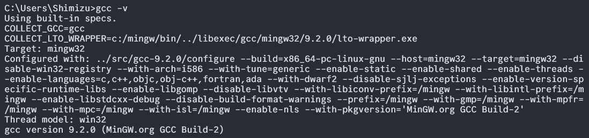
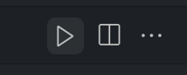
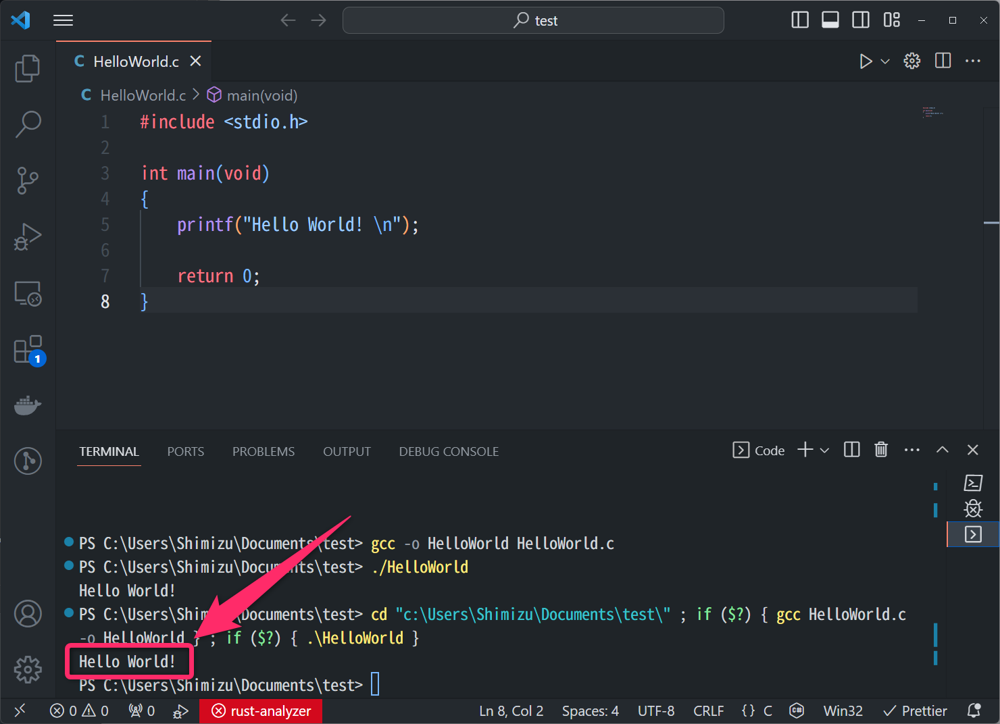
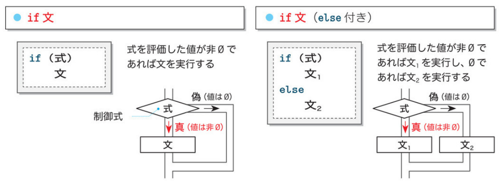
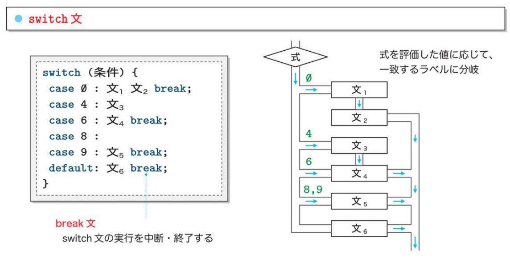
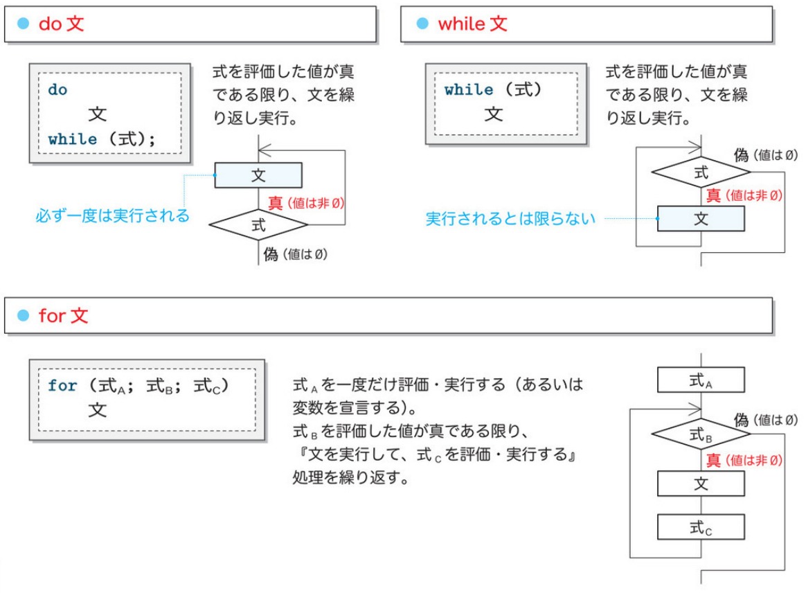
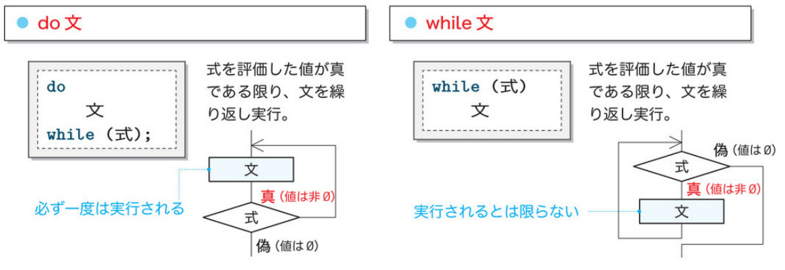
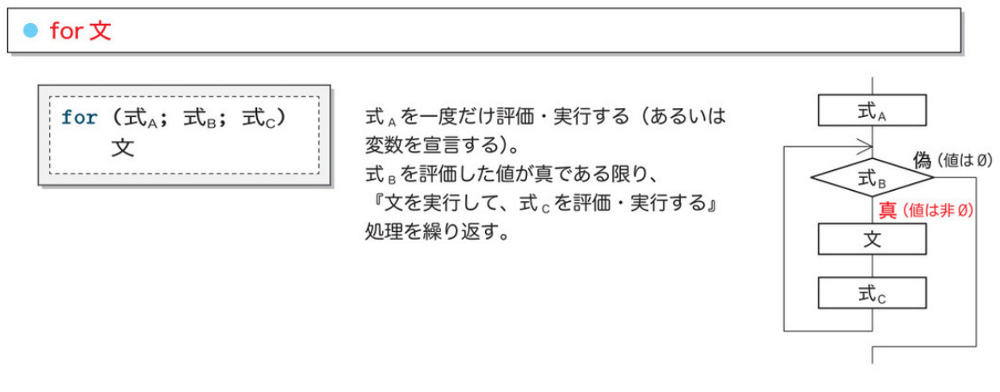

# プログラミング実習
# 第2回授業資料
**VSCodeの設定，分岐，繰り返し**

講義担当：清水 哲也(shimizu@info.shonan-it.ac.jp)

---

# 今回の授業内容

- 授業内容について説明
- VSCodeの設定
- 復習
- 授業課題
- 宿題

---

<div Align=center>

# 授業内容について説明

</div>

---

# 授業内容について説明

## 清水クラスの特徴
プログラミング実習のクラスの中で（多分）1番難しい内容を扱います
できる限りModづくりに時間を使いたいので復習部分は解説しません

## プログラミング基礎の復習について
今回は教科書の第1章〜第4章までの内容を扱います
具体的には，**変数**，**読み込みと表示**，**演算**，**型**，**if文**，**switch文**，**do while文**，**for文**，**多重ループ**です

---

<div Align=center>

# VSCodeの設定

</div>

---

# VSCodeの設定

## MinGWのPATH確認 part.1

MinGWのPATH設定ができているかを確認します
「**コマンドプロンプト**」か「**ターミナル**」を起動してください
次のコマンドを入力してEnterキーを押してください

```shell
gcc -v
```

---

<!-- _class: no-footer -->

# VSCodeの設定
### MinGWのPATH確認 part.2

実行結果が以下のようになっていればPATH設定が正しくされています．
<div Align=center>



</div>

最後の行に `gcc version 9.2.0 (MinGW.org GCC build-2)` などと書かれていると思います
（数字は`9.2.0`でなくでも大丈夫です）

---

# VSCodeの設定

## VSCodeのターミナルから標準入力を使えるようにする
- 「**拡張機能**」から「**Code Runner**」を探します
- 「**Code Runner**」の右側にある歯車のマークを押します
- 「**拡張機能の設定**」をクリックします
- 設定画面が表示されるので「**Run in Terminal**」にチェックをいれます

これで，`scanf();`などの標準入力がターミナルから行うことができます

---

# VSCodeの設定

設定が完了したので，動作確認をします
ファイルを新規作成してファイル名を **HelloWorld.c**とします
作成したファイルに以下の内容を記入します

```C
#include<stdio.h>

int main(void)
{
    printf("Hello World!\n");

    return 0;
}
```


---

# VSCodeの設定

VSCodeの右上にある三角マークを押して実行してみましょう

<div Align=center>



</div>


---

<!-- class: no-footer -->

# VSCodeの設定
VSCodeの下にターミナルが起動して実行結果が表示されると思います

<div Align=center>



</div>

---

<div Align=center>

# 復習

</div>

---

# 復習：if 文

ある条件が成立したときにのみ処理を行うことができる分岐です

<div Align=center>


</div>

---

# 復習：条件式評価

条件式を評価する
- 等価演算子
- 関係演算子
- 論理演算子

などなど

---

# 復習：条件式の評価

## 等価演算子

<div Align=center>

| 演算子 |    例    |                       意味                        |
| :----: | -------- | ------------------------------------------------- |
|  `==`  | `a == b` | `a`と`b`の値が等しければ`1`,そうでなければ`0`     |
|  `!=`  | `a != b` | `a`と`b`の値が等しくなければ`1`,そうでなければ`0` |

</div>

---

# 復習：条件式の評価

## 関係演算子

<div Align=center>

| 演算子 |   例   |                     意味                      |
| :----: | ------ | --------------------------------------------- |
|  `<`   | `a<b`  | `a`が`b`よりも小さければ`1`,そうでなければ`0` |
|  `>`   | `a>b`  | `a`が`b`よりも大きければ`1`,そうでなければ`0` |
|  `<=`  | `a<=b` | `a`が`b`以下であれば`1`,そうでなければ`0`     |
|  `>=`  | `a>=b` | `a`が`b`以上であれば`1`,そうでなければ`0`     |

</div>

---

# 復習：条件式の評価

## 論理演算子

<div Align=center>

|    演算子    |       例       |                        意味                         |
| :----------: | -------------- | --------------------------------------------------- |
|     `&&`     | `a&&b`         | `a`,`b`がいずれも非`0`であれば`1`,そうでなければ`0` |
| &#x7C;&#x7C; | a&#x7C;&#x7C;b | `a`,`b`の一方でも非`0`であれば`1`,そうでなければ`0` |

</div>

---

# 復習：switch文
式を評価した値に応じてプログラムの流れを複数に分岐できます

<div Align=center>



</div>

---

# 復習：繰り返し文
制御式を評価して条件に合えばループ本体が実行されます

<div Align=center>



</div>

---

# 復習：do文, while文
do文：**後判定**．ループ本体は少なくとも1回は必ず実行されます
while文：**前判定**．ループ本体は1回も実行されない可能性があります

<div Align=center>



</div>

---

# 復習：for文
for文：**前判定**．ループ本体は1回も実行されない可能性があります．単一のカウンタ用変数で制御する繰り返し方法です

<div Align=center>



</div>

---

# 授業課題

Moodleに授業課題ファイルがあります．
それをやってください．

手順としては以下の通りです．
- プログラムを作成する
- 実行する
- プログラムと実行結果のスクショをMoodleに提出する

積極的に**周りの人と相談したり，教えあったり，協力**してください．
※答えをそのまま渡すのはやめましょう

提出期限は10月1日(水) 21:00まで